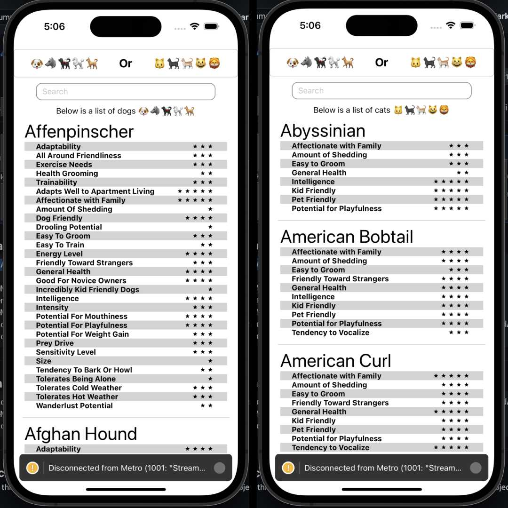

# Dogs and Cats Breed App

This app allows you to view different breeds of dogs and cats along with their ratings for various characteristics. You can select whether you want to see the dogs or the cats.

The app is written in ReactNative.

## Installation

To download and run this app, follow these steps:

1. Clone the repository to your local machine using the following command:

git clone https://github.com/alx-rg/dogsAndCatsBreedApp.git

2. Navigate to the project directory:

cd dogsAndCatsBreedApp

3. Install the dependencies:

npm install

4. Run the app:

npm start

5. Open the app on your device using the Expo app.

That's it! Your app should now be up and running.
